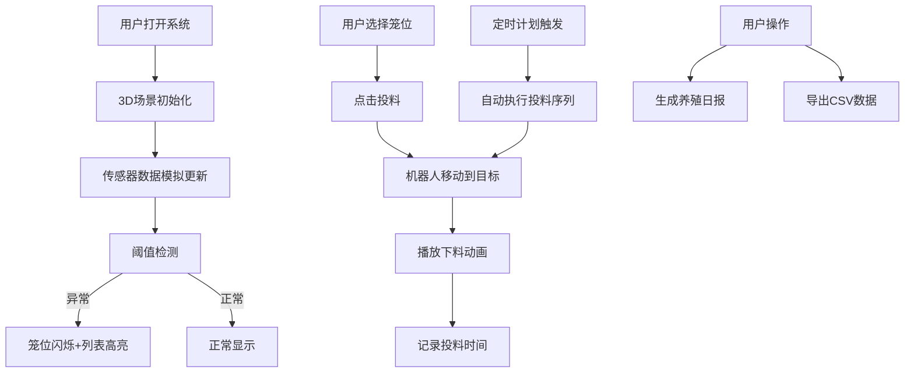

## 1. 产品概述

基于Three.js的3D自动化立体养殖场喂料巡检系统，通过沉浸式3D可视化界面实现养殖笼架的远程监控与管理。主要解决传统养殖场人工巡检效率低、监控不及时、投料管理不规范等问题，目标用户为规模化养殖场管理人员和技术人员。

### 产品价值
- 提升巡检效率：轨道式机器人自动巡检，实时监控每个笼位状态
- 精细化管理：精确控制投料时间和数量，记录完整操作日志
- 异常预警：温湿度阈值实时检测，异常情况自动报警
- 数据驱动：完整的数据记录和分析功能，支持决策优化

## 2. 核心功能

### 2.1 用户角色
| 角色 | 注册方式 | 核心权限 |
|------|----------|----------|
| 管理员 | 系统内置 | 完整操作权限，包括阈值配置、定时计划设置、数据导出 |

### 2.2 功能模块
1. **3D场景主界面**：多层养殖笼架可视化、机器人实时位置、温湿度数据显示
2. **机器人控制**：手动移动控制、自动巡检、摄像头视角切换
3. **投料管理**：单笼位投料、整排投料、投料动画、投料记录
4. **异常预警**：阈值配置、异常检测、闪烁告警、列表高亮
5. **数据报表**：养殖日报生成、历史数据CSV导出
6. **定时计划**：定时投料配置、自动执行

### 2.3 页面详情
| 页面名称 | 模块名称 | 功能描述 |
|---------|---------|----------|
| 主界面 | 3D场景展示 | 渲染3层养殖笼架，每层8个笼位，实时显示温湿度数据 |
| 主界面 | 机器人视角 | 右上角小窗口显示机器人摄像头实时画面 |
| 主界面 | 控制面板 | 左侧面板包含笼位选择、投料控制、阈值配置 |
| 主界面 | 告警列表 | 右下角显示异常笼位列表，高亮显示 |
| 主界面 | 数据统计 | 底部显示当日统计数据（最高/最低温度、平均湿度） |
| 主界面 | 定时计划 | 定时投料配置界面，支持设置多个时间点 |

## 3. 核心流程

### 手动投料流程
用户选择笼位 → 点击投料按钮 → 机器人移动到目标位置 → 播放下料动画 → 记录投料时间 → 更新笼位状态

### 异常预警流程
传感器数据更新 → 阈值检测 → 超出阈值 → 笼位闪烁红色 → 添加到告警列表 → 声音/视觉提示

### 定时投料流程
用户配置定时时间 → 系统监控当前时间 → 到达设定时间 → 自动触发投料序列 → 机器人依次执行投料任务

## 4. 用户界面设计

### 4.1 设计风格
- **主色调**：深蓝科技感（#1a365d）配合绿色农业主题（#38a169）
- **警示色**：红色（#e53e3e）用于异常告警，橙色（#dd6b20）用于警告
- **按钮风格**：圆角矩形，带微妙阴影，hover时有轻微上浮效果
- **字体**：使用'JetBrains Mono'等宽字体显示数据，'Noto Sans SC'用于中文文本
- **布局**：左侧控制面板 + 中央3D场景 + 右上角摄像头视角 + 底部状态栏
- **图标**：使用lucide-react图标库，保持统一线性风格

### 4.2 页面设计概述
| 页面名称 | 模块名称 | UI元素 |
|---------|---------|--------|
| 主界面 | 3D场景 | 工业风照明，笼架金属质感，数据标签悬浮显示 |
| 主界面 | 控制面板 | 半透明深色背景，分组卡片式布局，实时数据刷新动画 |
| 主界面 | 告警列表 | 表格形式，异常行红色背景闪烁效果 |
| 主界面 | 机器人视角 | 画中画效果，绿色边框，实时FPS显示 |

### 4.3 响应式
- 桌面端：完整布局，3D场景占据主要空间
- 移动端：折叠式面板，触控优化的控制按钮

### 4.4 3D场景设计
- **环境**：工业厂房风格，柔和的顶部照明，地面网格线
- **灯光**：环境光 + 方向主光 + 笼架补光，突出金属质感
- **相机**：默认透视视角，可通过鼠标拖拽旋转、滚轮缩放
- **机器人动画**：移动时有轻微的悬浮上下浮动效果，投料时有机械臂动作
- **后处理**：轻微泛光效果，提升科技感
- **性能**：使用实例化渲染（InstancedMesh）优化笼位渲染，保持60FPS
