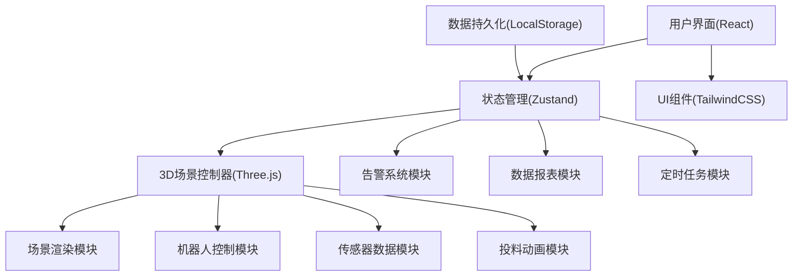
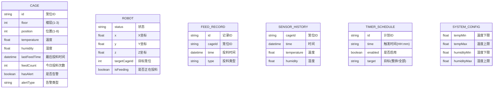

## 1. 架构设计



## 2. 技术描述
- **前端**：React@18 + TypeScript + Vite + TailwindCSS@3
- **3D引擎**：Three.js（原生，不使用@react-three/fiber以获得更精细的控制）
- **状态管理**：Zustand
- **图标**：lucide-react
- **后端**：无需后端，纯前端模拟，数据存储于LocalStorage
- **数据**：模拟数据生成，支持本地存储

## 3. 目录结构

```
src/
├── components/           # UI组件
│   ├── ControlPanel.tsx  # 左侧控制面板
│   ├── RobotView.tsx     # 机器人视角窗口
│   ├── AlertList.tsx     # 告警列表
│   ├── StatusBar.tsx     # 底部状态栏
│   ├── ReportDialog.tsx  # 报表弹窗
│   └── TimerConfig.tsx   # 定时配置
├── store/                # 状态管理
│   └── useFarmStore.ts   # 养殖场状态store
├── three/                # Three.js相关
│   ├── FarmScene.ts      # 3D场景主类
│   ├── CageRack.ts       # 笼架模型
│   ├── Robot.ts          # 机器人模型
│   ├── SensorLabel.ts    # 传感器标签
│   └── FeedAnimation.ts  # 投料动画
├── utils/                # 工具函数
│   ├── dataGenerator.ts  # 模拟数据生成
│   ├── csvExporter.ts    # CSV导出
│   └── reportGenerator.ts # 报表生成
├── types/                # 类型定义
│   └── index.ts          # 全局类型
├── App.tsx               # 主应用
├── main.tsx              # 入口
└── index.css             # 全局样式
```

## 4. 核心数据模型

### 4.1 数据模型定义



### 4.2 TypeScript 类型定义

```typescript
interface Cage {
  id: string;
  floor: number;
  position: number;
  temperature: number;
  humidity: number;
  lastFeedTime: Date | null;
  feedCount: number;
  hasAlert: boolean;
  alertType: 'temperature' | 'humidity' | null;
}

interface Robot {
  status: 'idle' | 'moving' | 'feeding';
  position: { x: number; y: number; z: number };
  targetCageId: string | null;
  cameraView: THREE.Camera;
}

interface FeedRecord {
  id: string;
  cageId: string;
  time: Date;
  type: 'manual' | 'scheduled' | 'batch';
}

interface SensorHistory {
  cageId: string;
  time: Date;
  temperature: number;
  humidity: number;
}

interface TimerSchedule {
  id: string;
  time: string;
  enabled: boolean;
  target: 'all' | 'floor1' | 'floor2' | 'floor3';
}

interface SystemConfig {
  tempMin: number;
  tempMax: number;
  humidityMin: number;
  humidityMax: number;
}

interface DailyReport {
  date: string;
  maxTemperature: number;
  minTemperature: number;
  avgHumidity: number;
  feedCountByCage: Record<string, number>;
  alertCount: number;
}
```

## 5. 关键模块设计

### 5.1 3D场景模块 (FarmScene.ts)
- 负责Three.js场景初始化、渲染循环
- 管理笼架、机器人、灯光、相机
- 处理鼠标交互（旋转、缩放、平移）
- 双相机渲染（主场景相机 + 机器人相机）

### 5.2 机器人控制模块 (Robot.ts)
- 机器人模型构建（车身、轮子、机械臂、摄像头）
- 移动控制（计算路径、平滑移动动画）
- 投料动作（机械臂动画、下料粒子效果）
- 第二相机视角控制

### 5.3 告警系统模块
- 实时检测每个笼位的温湿度数据
- 超出阈值时触发视觉告警（红色闪烁）
- 维护告警列表，支持确认和消除
- 可配置的阈值参数

### 5.4 定时任务模块
- 基于setInterval的时间轮询
- 支持多个定时计划配置
- 到达时间自动触发投料任务队列
- 任务执行状态跟踪

## 6. 性能优化策略
1. 使用InstancedMesh渲染24个笼位，减少draw call
2. 传感器标签使用CSS2DRenderer，避免每帧更新3D文字
3. 投料粒子效果使用对象池复用粒子
4. 历史数据定期清理，仅保留24小时数据
5. 视锥剔除优化不可见物体渲染
